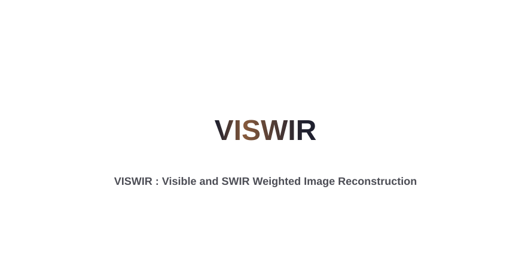
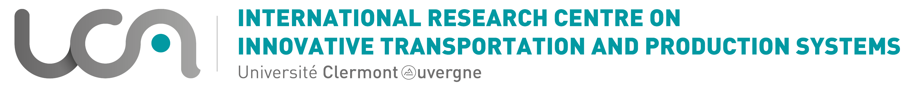
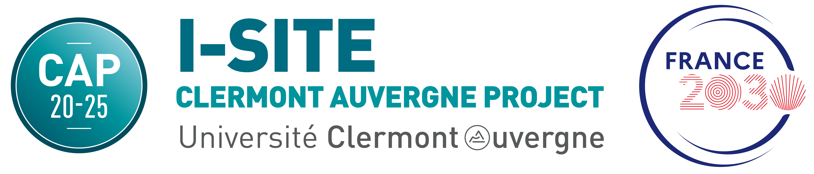
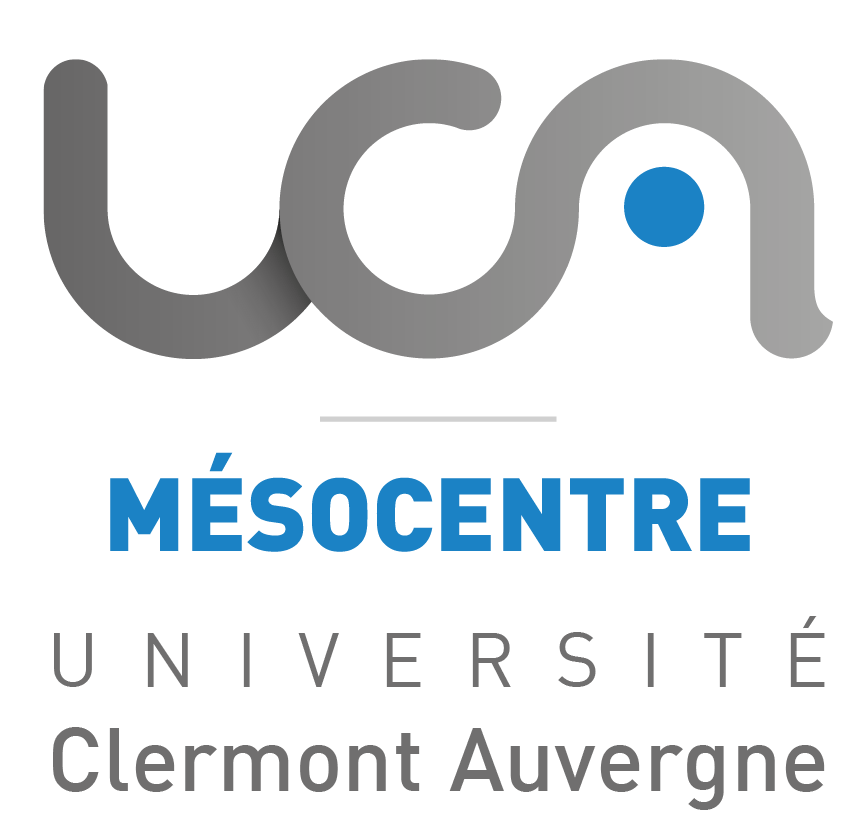

<!-- # VISWIR: Visible and SWIR Weighted Image Reconstruction -->
<p align="center">
  
</p>

<!--## Badges -->


[](https://www.microsoft.com/fr-fr/software-download/windows11)
[](https://www.microsoft.com/store/productId/9PJPW5LDXLZ5?ocid=pdpshare)


[](https://colab.research.google.com/github/comsee-research/viswir/blob/main/demo/VISWIR_demo.ipynb)
[](https://comsee-research.github.io/VISWIR/)
[](https://www.mdpi.com/1424-8220/26/13/4035)
[](https://doi.org/10.3390/s26134035)


## Introduction
This repository contains the code and datasets accompanying the paper "Enhancing Perception through Visible and SWIR Image Fusion in Harsh Environments" by Alexandre Riffard, Mathieu Labussière, Pierre Duthon, and Romuald Aufrère. The paper introduces VISWIR, an image fusion method that combines Visible and Short Wave Infrared (SWIR) spectra to enhance the perception capabilities of autonomous vehicles in harsh environmental conditions.

## Table of Contents

- [Introduction](#introduction)
- [Features](#features)
- [Visuals](#visuals)
- [Getting Started](#getting-started)
  - [Prerequisites](#prerequisites)
  - [Installation](#installation)
- [Usage](#usage)
- [Dataset](#dataset)
- [Contributing](#contributing)
- [License](#license)
- [Authors and acknowledgment](#authors-and-acknowledgment)
- [Contact](#contact)


## Features 🚀

- **Image Fusion**: Combines visible and SWIR images to improve visibility and obstacle detection in fog, rain, and smoke.
- **Weight Map Generation**: Uses weight maps to optimize the fusion process.
- **Pyramid Fusion**: Integrates images at multiple scales for superior image quality.
- **Post-processing**: Enhances visual quality and detail in fused images.

## Visuals 🎞️
Demo of the solution:

[](https://www.youtube.com/watch?v=f4hYrRZebB8)


## Getting Started ⚙️

### Prerequisites 🧰

Before installing VISWIR, make sure your system has:

- **Python 3.11.x** (tested with 3.10.11, recommended 3.11.2 for containers)  
- **pip** (Python package installer, comes with Python ≥ 3.4)  
- **virtualenv / venv** (recommended for local installation)  
- **Git** (to clone the repository)  
- **System libraries** (needed for OpenCV, imagecodecs, etc.)  
  - Linux (Debian/Ubuntu):  
    ```bash
    sudo apt-get update && sudo apt-get install -y \
        build-essential wget curl git \
        libgl1 libglib2.0-0 libxrender1 \
        zlib1g-dev libffi-dev libssl-dev \
        libsqlite3-dev libbz2-dev liblzma-dev \
        libreadline-dev libncurses5-dev libgdbm-dev
    ```


<!-- > -->
> **Development environment:**
> - Python 3.11.2 (also tested with 3.10.2)  
> - PyTorch 2.x (compiled with CUDA 12.1)  
> - CUDA Toolkit 12.2 (nvcc)  
> - NVIDIA Driver supporting CUDA 13.0
> - OS: Windows 11 (development), WSL2 Debian (validation)

Optional (depending on usage):
- **NVIDIA GPU drivers + CUDA/cuDNN** if you want to run PyTorch in GPU mode locally.  
  (⚠️ In the container build, only CPU wheels are installed by default.)

### Supported Platforms & HPC Validation

✅ The code has been developed and tested on:
- Windows 11 (development environment)
- WSL2 (Debian) for Linux validation
- Singularity container (CPU‑only) for reproducible runs
- HPC2 cluster at [Mésocentre Clermont Auvergne](https://hub.mesocentre.uca.fr/docs/cluster/hpc2/)

**HPC2 environment details:**
- OS: Linux
- Job scheduler: SLURM

VISWIR has been successfully executed on HPC2 for large‑scale optimization tasks (Optuna mode), leveraging high‑memory partitions.


### Installation 🛠️

1. Clone the repository:
   ```bash
   git clone https://github.com/comsee-research/viswir.git
   cd viswir
   ```

2. Install the required Python packages:

   **Option A – Local installation with virtualenv**  
   ```bash
   chmod +x install_packages_venv.sh
   ./install_packages_venv.sh
   ```

   **Option B – Inside the container**  
   Dependencies are installed automatically via `install_packages_container.sh` during the Singularity build.
   How to build (CPU only) --> [HELP.md](./HELP.md) (en) - [HELP_fr.md](./HELP_fr.md) (fr)


## Usage 🏃‍➡️

VISWIR can be run in several modes, depending on your needs:

* **SQL mode (recommended)**: runs the fusion process using parameters defined in `parameters.json` on an entire folder, and saves the results (metrics + images if requested) in a SQLite database.
* **Optuna mode**: automatically performs hyperparameter optimization for the fusion process using [Optuna](https://optuna.org/).
* **Fast mode (--fast)**: ultra-light pipeline for quickly testing a single image pair (fusion + optional detection), without metric computation or database recording.
* **Fixed mode**: legacy mode, deprecated (but same as SQL).

---

### 1. Configuration Files

* **`config_viswir.yaml`**
  General control parameters:

  * `visible_folder`, `swir_folder`, `output_folder`: data paths.
  * `ref_image_path`: reference image (for R-IQA).
  * `ground_truth_path`: detection annotations.
  * `mode`: `"fixed"`, `"sql"`, or `"optuna"`.
  * `run_detection`: enables/disables YOLO detection.
  * `save_output`: toggles saving of fused images.

* **`parameters.json`**
  Fusion parameters used in Fixed and SQL modes (`facteur_swir`, `beta`, `level`, `apply_gamma`, `gamma_value`).
  `mode_fixe` is a legacy field and should not be modified.

* **`fast_config.yaml`**
  Minimal configuration for the fast pipeline:

  * `run_detection`: enables/disables detection.
  * `facteur_swir`, `beta`, `level`, `apply_gamma`, `gamma_value`.

* **`logger_config.yaml`**
  Logging system configuration (level, console/file output, format, rotation).

* **`optuna_config.yaml`**
  Optuna optimization parameters (number of trials, parallel jobs, pruner, timeout, etc.).

* **`optuna_search_space.yaml`**
  Definition of the search space for Optuna (ranges and types of hyperparameters).

* **`yolo_config.json`**
  YOLO model parameters for detection (weights, thresholds, device, allowed classes).

---

### 2. Execution

#### Fixed mode (parameters defined in `parameters.json`, fusion + CSV logging)

```bash
python VISWIR_vQuasar.py
```

#### SQL mode (parameters defined in `parameters.json`, fusion + database logging)

```bash
# In config_viswir.yaml: mode: "sql"
python VISWIR_vQuasar.py
```

#### Optuna mode (hyperparameter optimization)

```bash
# In config_viswir.yaml: mode: "optuna"
python VISWIR_vQuasar.py
```

#### Fast/Test mode (--fast)

```bash
python VISWIR_vQuasar.py --fast \
    --visible ../data/vis.jpg \
    --swir ../data/swir.png \
    --out ../results/fused.png
```

* Use `fast_config.yaml` for fusion parameters.
* Use `yolo_config.json` if `run_detection: true`.
* Does not compute metrics — only saves the final output.

#### Container execution (CPU only)
```bash
singularity run VISWIR_ex.sif --fast \
    --visible /VISWIR/data/vis.jpg \
    --swir /VISWIR/data/swir.png \
    --out /VISWIR/results/fused.png
```
More info in [HELP.md](./HELP.md) and [HELP_fr.md](./HELP_fr.md) (french translation).
Singularity build file availaible [here](./tools/Singularity).

---

### Project Structure 🗂️
```
 /VISWIR
 ├── config/                        (Configuration files)
 ├── data/                          (Input datasets)
 ├── results/                       (Processing results)
 ├── msc/                           (Funding, HPC logos, and SOTA comparison scripts)
 │ └── other/                       (Unofficial SOTA re-implementations)
 │     ├── README.md                # References & disclaimer for unofficial code
 │     ├── Top-Hat.py               # Re-implementation of Top-Hat transform (Herrera-Arellano et al., 2021)
 │     └── V-SWIR-IF.py             # Re-implementation of V-SWIR-IF (Fang et al., 2023)
 ├── src/                           (Main source code)
 │ ├── VISWIR_vQuasar.py            # Main entry point
 │ ├── logs/                        # Log files
 │ │ 
 │ ├── fusion/                      # Scientific core
 │ │ ├── NIQE/                      # NIQE implementation
 │ │ │ ├── *.mat                    # Matlab files for NIQE
 │ │ │ ├── niqe.py                  # NIQE computation
 │ │ ├── fusion.py                  # Main fusion functions
 │ │ ├── functions.py               # Direct support functions
 │ │ ├── metrics.py                 # Metrics computation (SSIM, NIQE, etc.)
 │ │ ├── detection_module.py        # Detection (YOLO + F1)
 │ │ └── utils.py                   # Utilities (I/O, normalization, etc.)
 │ │ 
 │ ├── processing/                  # Batch/SQL orchestration
 │ │ ├── batch_runner.py            # Batch processing
 │ │ ├── sql_runner.py              # SQL processing
 │ │ ├── task_manager.py            # Task management
 │ │ └── interruption.py            # Interruption handling
 │ │ 
 │ ├── optimization/                # Optimization (Optuna, HPC)
 │ │ ├── optuna_runner.py           # Main Optuna loop
 │ │ ├── objective.py               # Objective functions
 │ │ ├── visualization.py           # Result visualization
 │ │ └── samplers.py                # Sampler/pruner configuration
 │ │ 
 │ ├── realtime/                    
 │ │ ├── fast_fusion_runner.py      # Fast pipeline
 │ │ ├── fast_config.py             # Fast configuration
 │ │ └── fast_detection.py          # Fast detection
 │ │ 
 │ └── common/                      # Shared modules
 │ │ ├── logger.py                  # Centralized logging
 │ │ ├── ui.py                      # Terminal display
 │ │ ├── results_db.py              # Database connection and saving
 │ │ ├── config_loader.py           # YAML/JSON loader
 │ │ └── datatypes.py               # Dataclasses (ProcessResult, Config, etc.)
 │ 
 ├── test/                          (Test scripts)
 ├── tools/                         (Utilities and SQL)
 │
 ├── HELP.md                        (Singularity guide)
 ├── HELP_fr.md                     (Singularity guide but in french)
 ├── install_packages_venv.sh       (Local installation via venv)
 ├── install_packages_container.sh  (Container installation)
 ├── LICENSE.txt                    (Project license)
 ├── README.md                      (Project overview)
 ├── requirements.txt               (List of Python dependencies)
```

## Dataset 🖼️
The dataset used in this paper is available upon request. Please contact the authors for access.

## License 📜
This project is licensed under the GNU Lesser General Public License 3.0 - see the [LICENSE](./LICENSE.txt) file for details.


## Authors and acknowledgment 🤝
Riffard Alexandre (1), Mathieu Labussière (1), Pierre Duthon (2), Romuald Aufrère (1)

(1) Université Clermont Auvergne, Clermont Auvergne INP, CNRS, Institut Pascal, F-63000 Clermont-Ferrand, France   
(2) Cerema, Research Team “Intelligent Transport Systems”, 8-10 Rue Bernard Palissy, CEDEX 2, F-63017 Clermont-Ferrand, France

*This work was supported by the International Research Center ''Innovation Transportation and Production Systems'' of the I-SITE CAP 20-25.*

<p align="center">
  
  &nbsp;&nbsp;&nbsp;&nbsp;&nbsp;&nbsp;&nbsp;&nbsp;
  
</p>

This work was granted access to the HPC resources of the [Mésocentre Clermont Auvergne](https://hub.mesocentre.uca.fr/) (cluster HPC2) of the Université Clermont Auvergne (France).  
We gratefully acknowledge the support of the Mésocentre team for providing computational resources and assistance.

<p align="center">
  
</p>

## Contacts 📧
For any questions or inquiries, please contact [Alexandre Riffard](mailto:alexandre.riffard@uca.fr).

## Citation 📝
If you use this code in your project, please consider citing the following papers:
1. VISWIR:
    ```bibtex
    @Article{s26134035,
    AUTHOR = {Riffard, Alexandre and Labussière, Mathieu and Duthon, Pierre and Aufrère, Romuald},
    TITLE = {Enhancing Perception Through Context-Adaptive Visible and SWIR Image Fusion in Harsh Environments},
    JOURNAL = {Sensors},
    VOLUME = {26},
    YEAR = {2026},
    NUMBER = {13},
    ARTICLE-NUMBER = {4035},
    URL = {https://www.mdpi.com/1424-8220/26/13/4035},
    PubMedID = {42451277},
    ISSN = {1424-8220},
    DOI = {10.3390/s26134035}
    }
    ```
2. Dataset:
    ```bibtex
    @inproceedings{riffard2024exploitation,
    title={Exploitation d'un capteur proche infrarouge (SWIR) pour la perception des robots mobiles en conditions m{\'e}t{\'e}orologiques difficiles},
    author={Riffard, Alexandre and Labussi{\`e}re, Mathieu and Duthon, Pierre and Aufr{\`e}re, Romuald},
    booktitle={Reconnaissance des Formes, Image, Apprentissage et Perception (RFIAP'24)},
    year={2024}}
    ```
